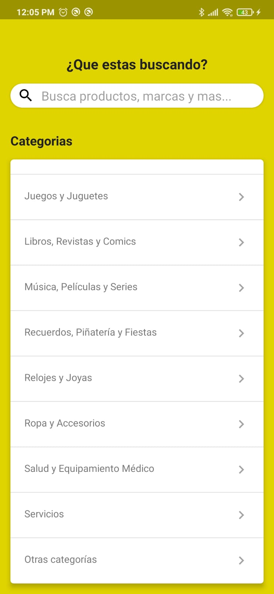
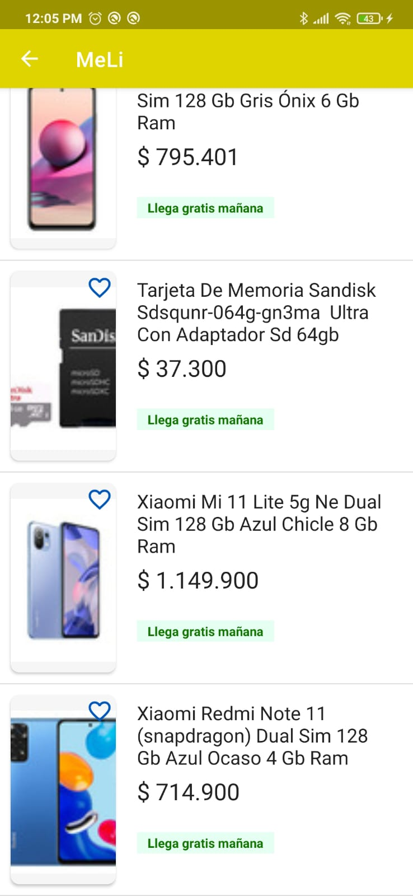
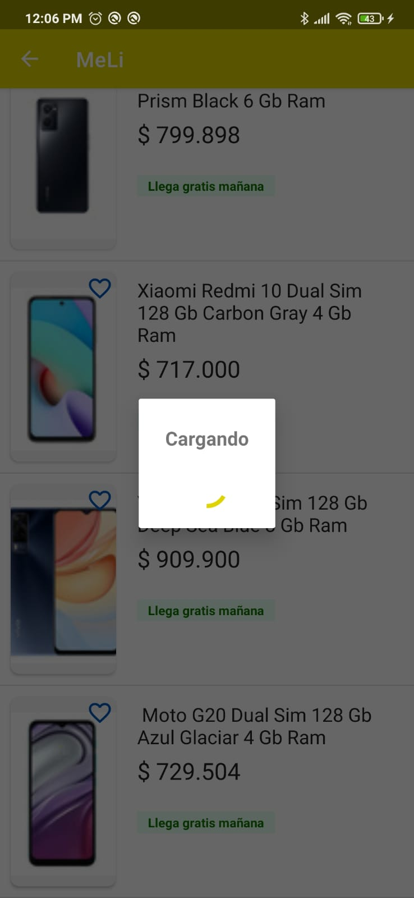

# Technical test

Crear una applicación movil Android con mínimo las siguientes condiciones:

La app debería contar con tres pantallas:
1. Campo de búsqueda.
2. Visualización de resultados de la búsqueda.
3. Detalle de un producto.
Puedes entregar un listado y detalle de productos que sea puro texto, o un buscador con
imágenes, iconos y texto, y un detalle completo del producto, como el que se muestra en la
web.

## Architecture

Se uso MVVM como patron de diseño impementado tambien Clean Arquitecture para dividir las responsabilidades de la app en diferentes capas.
Esto facilita su testeabilidad y escalabilidad a lo largo del tiempo.

Se utilizaron las siguientes capas
UI / Activity / ViewModel / UseCases / Respository

UI: Layouts con los componentes que el usuario va a visualizar
Activity: Intercomunicador entre el UI y el ViewModel
ViewModel: Controla las acciones del usuario y receptor de data de la siguiente capa(UseCases)
UseCases: Administra de donde se consume/guarda la informacion, puede ser local, remoto o alguna otra fuente, para esta app solo se utilzó remoto. 
Repository: Controla la respuesta de las fuente de datos. 

## Features

- Pantalla con un campo de busqueda o busqueda por categorias
- Pantalla donde muestra los resultados de la busqueda, incluye paginación
- Pantalla con una descripción mas detallada de la busqueda con un viewPager para las imagenes

## Screenshots

## Libraries

Para este proyecto usé las siguientes tecnologias:

- [Retrofit] : <https://square.github.io/retrofit>
- [Dagger Hilt] : <https://dagger.dev/hilt/gradle-setup.html>
- [ViewModel] : <https://developer.android.com/topic/libraries/architecture/viewmodell>
- [Picasso] : <https://github.com/square/picasso>
- [Turbine] : <https://github.com/cashapp/turbine>
- [Mockk] : <https://github.com/mockk/mockk>
- [JUnit] : <https://junit.org/junit4/>